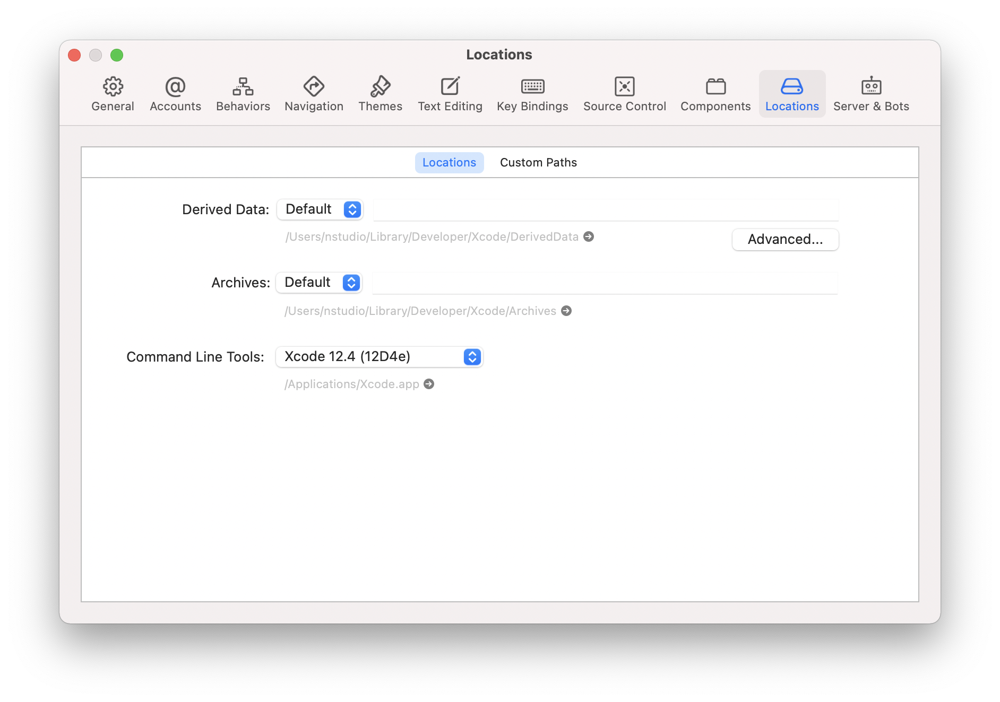

## Setting up your system

- [REFERENCE] https://github.com/NativeScript/docs/blob/master/docs/start/general-requirements.md
- [REFERENCE] https://github.com/NativeScript/docs/blob/master/docs/start/ns-setup-linux.md
- [REFERENCE] https://github.com/NativeScript/docs/blob/master/docs/start/ns-setup-os-x.md
- [REFERENCE] https://github.com/NativeScript/docs/blob/master/docs/start/ns-setup-win.md
- [REFERENCE] https://github.com/NativeScript/docs/blob/master/docs/start/quick-setup.md

---

<!-- TODO: make interactive -->

**Development OS**: macOS, Windows, Linux

**Target OS**: Android, iOS

Content dynamically changes based on the selection above to reduce the page complexity and hide irrelevant details.

---

This page will walk through installing everything you need to build your first NativeScript app.

### Windows + Android

You will need Node, NativeScript CLI (command line interface), Android Studio and a JDK (java development kit).

**Android Studio** is not strictly necessary &mdash; however it provides an easy to use interface for installing and managing the Android SDKs.

We recommend using [Chocolatey](https://chocolatey.org/) to install the required dependencies &mdash; a popular package manager for Windows.

To install **Node** and **JDK** open an Administrator Command Prompt (right click and select "Run as Administrator") and run the following command:

```powershell
choco install -y nodejs.install openjdk8
```

Setting up the Android development environment can be daunting if you are new to Android development, however following the next steps carefully will get you up and running in no time.

[Download and install Android Studio](https://developer.android.com/studio). In the installation wizard make sure to have the following components selected:

- Android SDK
- Android SDK Platform
- Android Virtual Device
- Performance (Intel ® HAXM) &mdash; optional, learn more about [AMD Processor & Hyper-V support](https://android-developers.googleblog.com/2018/07/android-emulator-amd-processor-hyper-v.html)

The setup may take a while, but once it has finished a welcome screen should appear.

Android Studio installs the latest Android SDK by default, which in most cases should be all that's needed to build a NativeScript app.

Configure the `ANDROID_HOME` environment variable for NativeScript to be able to find the Android SDK.

1. Search for "**Edit the system environment variables**" in Windows Search and select
2. Click on "**Environment variables...**" in the bottom corner
3. Under the "**User variables for...**" click on **New...** to create the `ANDROID_HOME` user variable that points to the path of the Android SDK:


The SDK is by default located at

```
%LOCALAPPDATA%\Android\Sdk
```

To find the actual location in the Android Studio **Settings**, navigate to **Appearance & Behavior › System Settings › Android SDK** and copy the Android SDK Location.

Add Android **platform-tools** to path.

1. Search for "**Edit the system environment variables**" in Windows Search and select
2. Click on "**Environment variables...**" in the bottom corner
3. Under the "**User variables for...**" select the **Path** variable and click **Edit...**
4. Click **New** and add the **platform-tools** path to the list.

The default location is inside the Android SDK's `platform-tools` folder:

```
%LOCALAPPDATA%\Android\Sdk\platform-tools
```

Install the NativeScript CLI globally:

```
npm install -g nativescript
```

To verify if the installation was successful, open a new Command Prompt window to ensure the new environment variables are loaded and run

```
ns doctor
```

If you see **No issues were detected** you have successfully set up your system.

#### Preparing an Android device

To run a NativeScript app, you will need an Android device &mdash; either a physical or a virtual device.

- **Using a physical device**: Connect the device using a USB cable, and follow the instructions from [Running on a physical device](/development-workflow.md)

- **Using a virtual device**: Open Android Studio, and open "AVD Manager" &mdash; If you are on the welcome screen, it's under the **Configure › AVD Manager** dropdown, otherwise under the **Tools › AVD Manager** menu.

  If the list of available Virtual Devices is empty, you will need to create a new AVD. Click on "**Create Virtual Device...**" then pick a phone from the list. You can select any phone from the list &mdash; for example "**Pixel 3 XL**" and then click "**Next**". For the System Image select the latest version (the highest API Level in the list). If the selection is greyed out, click the "Download" link next to the Release Name to download the System Image and then click "**Next**" and "**Finish**" to create the AVD. The newly created AVD should show up in the list, and you should be able to click the green "play" button to start the virtual device.

### Windows + iOS

:::warning Unsupported
A Mac is required to build projects that use native iOS code. Simpler apps can be tested using the NativeScript Playground.
:::

### macOS + Android

You will need Node, NativeScript CLI (command line interface), Android Studio and a JDK (java development kit).

**Android Studio** is not strictly necessary &mdash; however it provides an easy to use interface for installing and managing the Android SDKs.

We recommend using [Howbrew](https://brew.sh/) to install the required dependencies &mdash; a popular package manager for macOS.

:::warning
When installing Homebrew, carefully follow their instructions to avoid configuration issues.
:::

Once you have Homebrew installed, to install **Node** open a Terminal and run the following command:

```bash
brew install node
```

:::tip Pro tip!
If you need to work with multiple versions of node, you may skip installing node via Homebrew, and use a node version manager: [nvm](https://github.com/nvm-sh/nvm), [n](https://npmjs.com/n) or any other node version manager you prefer.
:::

To install a **JDK** run the following command:

```bash
brew install --cask adoptopenjdk # todo: check if it works with latest jdk
```

Setting up the Android development environment can be daunting if you are new to Android development, however following the next steps carefully will get you up and running in no time.

[Download and install Android Studio](https://developer.android.com/studio). In the installation wizard make sure to have the following components selected:

- Android SDK
- Android SDK Platform
- Android Virtual Device
- Performance (Intel ® HAXM) &mdash; optional, learn more about [AMD Processor & Hyper-V support](https://android-developers.googleblog.com/2018/07/android-emulator-amd-processor-hyper-v.html)

The setup may take a while, but once it has finished a welcome screen should appear.

Android Studio installs the latest Android SDK by default, which in most cases should be all that's needed to build a NativeScript app.

Configure the `ANDROID_HOME` environment variable for NativeScript to be able to find the Android SDK, and add the required tools to path.

Add the following lines to your shell profile, usually `~/.bash_profile` or `~/.bashrc`, or if you are using `zsh` then `~/.zshrc` config file:

```shell
export ANDROID_HOME=$HOME/Library/Android/sdk
export PATH=$PATH:$ANDROID_HOME/platform-tools
```

Install the **NativeScript CLI** globally:

```bash
npm install -g nativescript
```

To verify if the installation was successful, open a new Command Prompt window to ensure the new environment variables are loaded and run

```bash
ns doctor
```

If you see **No issues were detected** you have successfully set up your system.

#### Preparing an Android device

To run a NativeScript app, you will need an Android device &mdash; either a physical or a virtual device.

- **Using a physical device**: Connect the device using a USB cable, and follow the instructions from [Running on a physical device](/development-workflow.md)

- **Using a virtual device**: Open Android Studio, and open "AVD Manager" &mdash; If you are on the welcome screen, it's under the **Configure › AVD Manager** dropdown, otherwise under the **Tools › AVD Manager** menu.

  If the list of available Virtual Devices is empty, you will need to create a new AVD. Click on "**Create Virtual Device...**" then pick a phone from the list. You can select any phone from the list &mdash; for example "**Pixel 3 XL**" and then click "**Next**". For the System Image select the latest version (the highest API Level in the list). If the selection is greyed out, click the "Download" link next to the Release Name to download the System Image and then click "**Next**" and "**Finish**" to create the AVD. The newly created AVD should show up in the list, and you should be able to click the green "play" button to start the virtual device.

### macOS + iOS

You will need Node, NativeScript CLI (command line interface), XCode, xcodeproj, cocoapods.

We recommend using [Howbrew](https://brew.sh/) to install the required dependencies &mdash; a popular package manager for macOS.

:::warning Note
When installing Homebrew, carefully follow their instructions to avoid configuration issues.
:::

Once you have Homebrew installed, to install **Node** open a Terminal and run the following command:

```bash
brew install node
```

:::tip Pro tip!
If you need to work with multiple versions of node, you may skip installing node via Homebrew, and use a node version manager: [nvm](https://github.com/nvm-sh/nvm), [n](https://npmjs.com/n) or any other node version manager you prefer.
:::

Next you will need **XCode**. Open the **AppStore**, search for **XCode** and and install it.

Once the installation is complete (this may take a while &mdash; brew a coffee and enjoy a little break), open **XCode** and if it prompts you to install the Command-Line-Tools make sure to say **Yes**.

Open `XCode › Preferences › Locations` and make sure **Command Line Tools** is set



Install **ruby 2.7** and link it so it's available in your shell environment:

```bash
brew install ruby@2.7
brew link ruby@2.7
```

Add the following lines to your shell profile, usually `~/.bash_profile` or `~/.bashrc`, or if you are using `zsh` then `~/.zshrc` config file:

```shell
# Add rubygems to the path
export PATH=/opt/homebrew/lib/ruby/gems/2.7.0/bin:$PATH
```

:::warning Important
Make sure to open a new terminal window for the changes to take effect!
:::

In a new terminal window, install the **<abbr title="A package manager for managing 3rd party native dependencies">cocoapods</abbr>** and **<abbr title="CLI utility to interact with XCode projects">xcodeproj</abbr>** gems by running the following commands:

<!-- Note: xcodeproj seems to be installed when installing cocoapods via brew -->
<!-- brew install cocoapods # this will install both cocoapods and xcodeproj -->

```bash
gem install cocoapods
gem install xcodeproj
```

Next install **<abbr title="Python package manager">pip</abbr>** and **<abbr title="Python 2 & 3 compatibility package used by NativeScript">six</abbr>** by running the following:

```bash
sudo easy_install pip==20.3.3
python -m pip install six
```

:::tip NOTE
You may see a Deprecation warning when installing **six**, feel free to ignore it for now &mdash; NativeScript will update to Python 3.x in the near future.
:::

Install the **NativeScript CLI** globally:

```bash
npm install -g nativescript
```

:::tip NOTE
You may see Deprecation and security warnings from **npm**, these are safe to ignore.

_**More details for those curious:** The NativeScript CLI relies on 3rd party packages that may have been deprecated over the past years. We are slowly replacing these dependencies with newer, supported alternatives to resolve these warnings, however they are generally safe to ignore, since the CLI is never exposed to the public and it's only used for local development, where most of the security concerns don't apply._
:::

To verify if the installation was successful, open a new Terminal window to ensure the new environment variables are loaded and run

```bash
ns doctor
```

<!-- TODO: add ns doctor ios & ns doctor android! -->
<!-- If you see **No issues were detected** you have successfully set up your system. -->

If you see the following, you have successfully set up your system for iOS development. Select **Skip Step and Configure Manually** or hit `Ctrl+C` to exit.


#### Additional notes for M1 based machines:

:::danger TODO
This section is temporary for now - we can consolidate & make sure it works on M1 as expected with the above flow. May need couple adjustments.
:::

You may need to install rosetta2, run:

```bash
softwareupdate --install-rosetta
```

May need to install `ffi`

```
gem install ffi
```

<!-- 1. Node

We recommend using [Homebrew](https://brew.sh/) to install Node.

After Homebrew installation, run the following commands to install **Node**:

```powershell
brew install node
```

```warning
If you see a "Next steps:" Note about adding Homebrew to your **PATH**, follow those instructions to add to your profile.
```

```warning
TODO: make note of node version managers maybe?
```

1. Install Xcode via App Store

Open App Store from the Apple menu and search for 'Xcode' to install it.

Wait for this installation to complete.

3. Install Cocoapods and Xcodeproj

```
sudo gem install xcodeproj
sudo gem install cocoapods
pod setup
```

4. Install pip and six

```
python -m pip install --upgrade pip six
```

```warning Note
`pip` is a python installation manager. `six` provides compatibility utilities for Python 2 and 3.
```

5. Install NativeScript CLI

```
npm install -g nativescript
``` -->

## Integrating with native apps

Talk about how NativeScript can be embedded into existing apps - clear and detailed step-by-step guide. This is a huge potential for bringing more people into the ecosystem.

- https://github.com/NativeScript/docs/tree/master/docs/guides/integration-with-existing-ios-and-android-apps

## Building for Other Platforms/Devices

### Building for TV devices

### Building for Smart Watches

- [REFERENCE] https://github.com/NativeScript/docs/blob/master/docs/tooling/ios-watch-apps.md

### Potentially desktop in the future?
